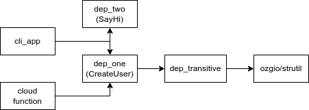

## Dependencies



## Structure

```text
.
├── cli_app
│   ├── go.mod
│   ├── go.sum
│   └── main.go
├── dep_one
│   ├── create_user.go
│   ├── go.mod
│   └── go.sum
├── dep_transitive
│   ├── generate_password.go
│   ├── go.mod
│   └── go.sum
├── dep_two
│   ├── go.mod
│   ├── go.sum
│   └── say_hi.go
├── function
│   ├── create_user.go
│   ├── go.mod
│   └── go.sum
└── README.md

```
## Deploy function
```shell
export GCP_REGION=us-central1
export GGP_PROJECT=tcgland-dev2
cd ./function
go mod vendor
gcloud functions deploy testing-monorepo-fnt \
    --gen2 \
    --runtime=go121 \
    --region=$GCP_REGION \
    --source=. \
    --entry-point CreateUser \
    --trigger-http \
    --allow-unauthenticated \
    --project=$GGP_PROJECT

curl "https://$GCP_REGION-$GGP_PROJECT.cloudfunctions.net/testing-monorepo-fnt?user_name=Angel"
```

## References

- [Go Workspaces](https://go.dev/doc/tutorial/workspaces)
- [GoogleCloudPlatform/buildpacks](https://github.com/GoogleCloudPlatform/buildpacks)
- [Google Cloud's buildpacks](https://cloud.google.com/docs/buildpacks/overview)
- [Google Cloud's buildpacks builders](https://cloud.google.com/docs/buildpacks/builders)

## Commands

| Command                                                                                    | Description                                                                                                                   |
|--------------------------------------------------------------------------------------------|-------------------------------------------------------------------------------------------------------------------------------|
| `go mod init github.com/angelcervera/go_monorepo_dependencies/cli-app`                     | init a new module                                                                                                             |
| `go mod edit -replace github.com/angelcervera/go_monorepo_dependencies/dep_one=../dep_one` | add replace to allow access to the dependency                                                                                 |
| `go mod tidy`                                                                              | After adding an import in the `.go` file, this command will add required dependencies in the `go.mod`, with the right version |
| `go get github.com/ozgio/strutil`                                                          | Adds a dependency into `go.mod` and it's                                                                                      |
|                                                                                            |                                                                                                                               |

## Notes

- **pseudo-version number** : It is
  a [temporal version](https://go.dev/doc/modules/version-numbers#pseudo-version-number) that `go mod tidy` will assign
  if the shared modules are not versioned.  
